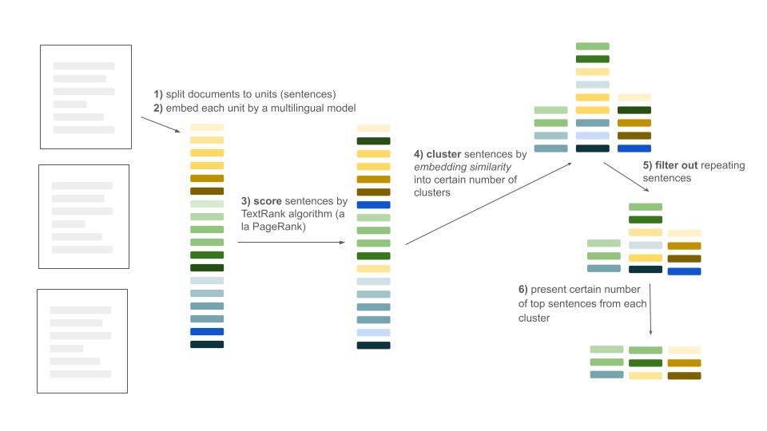
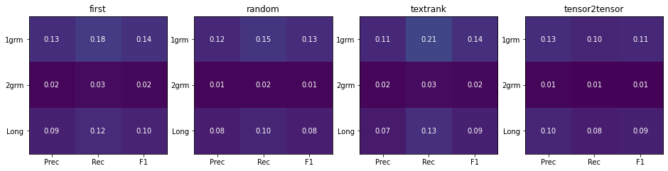
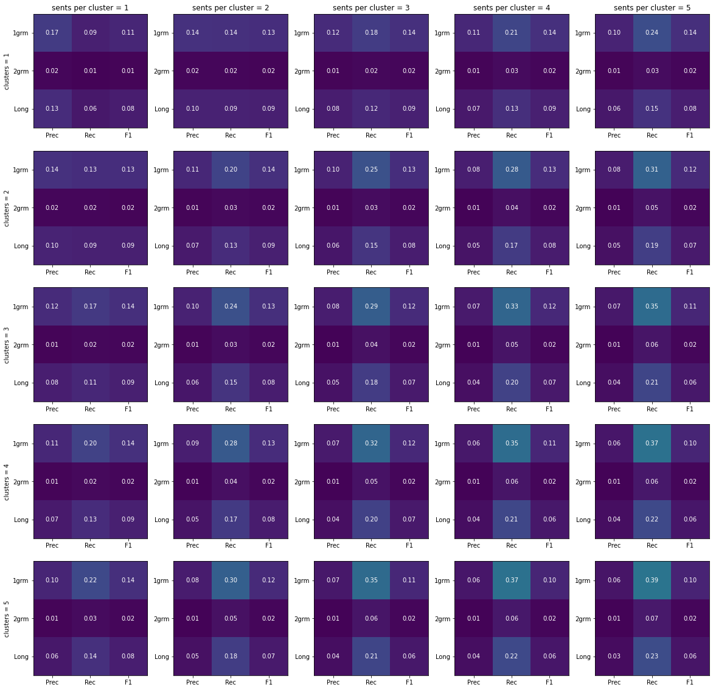
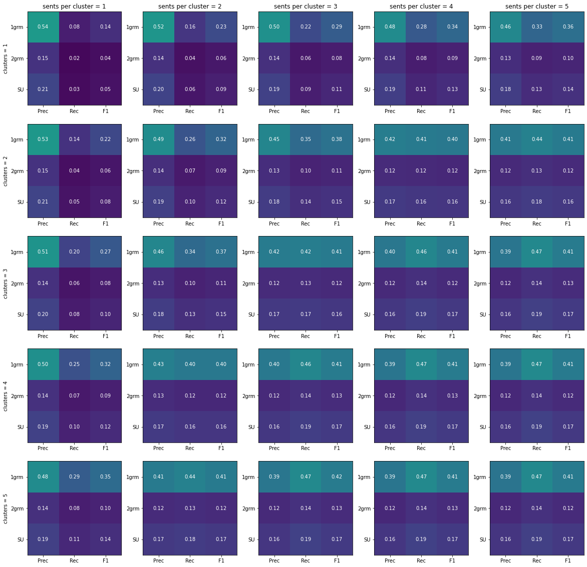

# Document Fusion
Unsupervised approach to document fusion/extractive summarization of multiple documents 

A collection of documents is processed in the following way:

Mapping the above steps into the code:
1) `fusion.tokenize()`
2) `SentenceTransformer.encode()`
3) `fusion.textrank()`
4) `fusion.cluster_hierarchy()`
5) `fusion.remove_duplicates()`
6) `fusion.view_collection()`

The summarization process is factored into **two main parts**:
* A) getting clusters of topics - steps 1, 2, 3, 4 `fusion.process_doc_collection()`
* B) viewing the clusters with a specified configuration of hyperparameters - steps 5, 6 `fusion.view_collection()`

This is to facilitate interactive usage:
* Each document collection is processed once (A),
* then the user keeps tweaking things based on their needs (B).

**References**:

| name | description | code |
|------|-------|------|
| textrank | https://aclanthology.org/W04-3252.pdf | [pagerank](https://networkx.org/documentation/stable/reference/algorithms/generated/networkx.algorithms.link_analysis.pagerank_alg.pagerank.html) |
| hierarchical clustering | [scikit user guide](https://scikit-learn.org/stable/modules/clustering.html#hierarchical-clustering) | [scikit docs](https://scikit-learn.org/stable/modules/generated/sklearn.cluster.AgglomerativeClustering.html#sklearn.cluster.AgglomerativeClustering)
|encoder | https://aclanthology.org/D19-1410.pdf | [huggingface](https://huggingface.co/sentence-transformers/distiluse-base-multilingual-cased-v2)

## Installation
python >= 3.6
```
# python -m venv .venv
# source .venv/bin/activate
pip install -r requirements.txt

# +jupyter, matplotlib for running the notebooks from this .venv:
pip install -r requirements_ntb.txt
```
## Usage

See `ntb-demo.ipynb` for working example.

Excluding distractions present in the notebook (ipywidgets), the basic usage is:
```
from sentence_transformers import SentenceTransformer
from fusion import process_doc_collection, view_collection

encoder = SentenceTransformer('sentence-transformers/distiluse-base-multilingual-cased-v2')
plaintext = "setnA. sentB. sentC. ..."

sents, sim_matrix, cluster_hierarchy = process_doc_collection(plaintext, encoder)
view_collection(sents, sim_matrix, cluster_hierarchy,
                n_clusters=2,
                n_tokens_per_cluster=3,
                keep_pairs_lt=1.)
````
which would present two topics (`n_clusters=2`) each represented by three sentences
(`n_tokens_per_cluster=3`), no duplicates would be removed (`keep_pairs_lt=1.`).

## Evaluation
We report ROUGE scores for unigrams, bigrams and longest common subsequence. 
### SumeCzech
https://aclanthology.org/L18-1551.pdf
#### Baselines

#### This work
for different number of topics (rows) and sentences per topic (columns)


### Multi-News
https://aclanthology.org/P19-1102.pdf

ROUGE scores for unigrams, bigrams and skip bigrams with a maximum distance of four words.

#### Baselines
| Method | ROUGE - unigrams | ROUGE - bigrams | ROUGE - SU |
|--------| -----------------|-----------------|------------|
|First-3 |             39.41|            11.77|      14.51 |
|LexRank |             38.27|            12.70|      13.20 |
|TextRank|             38.44|            13.10|      13.50 |
#### This work
For different number of topics (rows) and sentences per topic (columns).
Each hypothesis was capped at 300 words (to match the evaluation of the baselines)


### Replication

we use a cluster for parallel evaluation:

```
python eval.py --run_id=$RUN_ID --n_datapoints=100 --starttime=$TIMESTAMP --dataset=$DATASET
```

* `$DATASET in ("sumec", "multinews")`
* _sumec_: `$RUN_ID in <0, ... 444>`; _multinews_ `$RUN_ID in <0, ..., 56>`

This creates 445 (57) `.jsonl` files in `results/$DATASET/$TIMESTAMP` directory.

These files are to be merged by:
```
python eval.py --merge_summary_files_pth results/$DATASET/$TIMESTAMP
```
into the final `results/$DATASET/$DATETIME/_FINAL` file.

## Known issues
* simplistic sentence tokenization (nltk)
* pagerank fails to converge for some datapoints (Sumeczech: 1.2%, Multinews: 2.8%)
